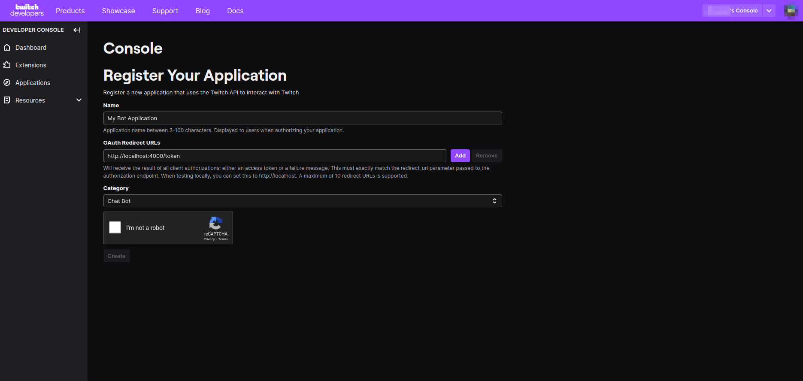

# Tawny Twitch Bot

A [Twitch](https://twitch.tv/) bot that provides games & overlays.

## Setup

To setup the bot you need a bot Twitch account (just a regular account) and a [Twitch Application](https://dev.twitch.tv/console/apps).

Follow the instructions:

-   Create a new Application
    

-   You should see this page
    

-   Fill your application
    

-   Copy your Client ID & Secret
    

-   Create a `.env` file in `packages/nest/` with the following content
    

    -   `DATABASE_URL`: database connection string for [Prisma](https://prisma.io)
    -   `CLIENT_ID`: your client ID
    -   `CLIENT_SECRET`: your client secret
    -   `BOT_USERNAME`: your bot's username (the account you created for the bot)
    -   `CHANNEL`: the channel you want the bot to join. You can give multiple channels seperated with comma like so: `CHANNEL,CHANNEL`

## Running

You can run the project with `pnpm start:dev` (`bun start:dev` if you're [Tawny](https://github.com/twny)).

## Login with Bot Account

Open [http://localhost:3000/](http://localhost:3000/) in your browser and you should see a button saying `Connect to Twitch`.  
Once you connect to Twitch, the bot will join the channel.

## Commands

TODO

## Overlays

TODO
